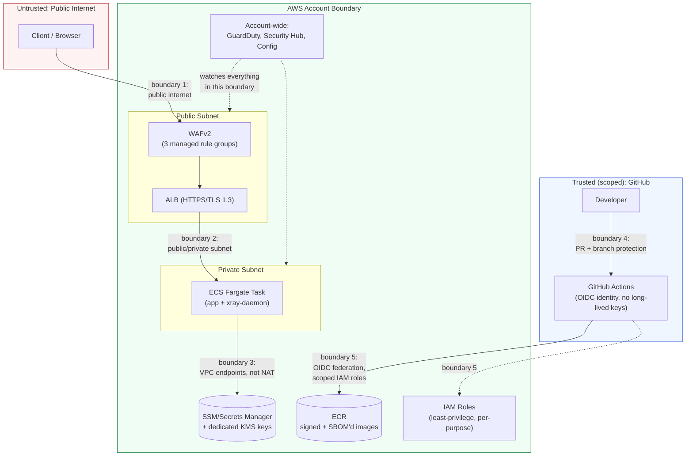

# Threat Model — Secure Delivery Platform

This is a STRIDE-based threat model of the architecture built across
Weeks 1–10 (`weeks/`). It covers `devsecops-bootcamp` (Terraform) and, by
extension, `devsecops-bootcamp-cdk` — the two repos deploy the same
architecture with the same threat surface; where the CDK repo differs in
a way that changes a threat or mitigation, it's called out explicitly.

This document is deliberately not a self-congratulation exercise. Every
mitigation below is a real, already-built, referenced control — and the
Residual Risks section at the end is the part worth reading most
carefully: a threat model that claims zero remaining risk is a bigger red
flag than an honest list of accepted trade-offs.

## Scope

In scope: the application delivery pipeline (source → CI → registry →
deployment) and the runtime architecture (ALB → ECS Fargate → AWS
services), plus the account-level security baseline (Week 6). Out of
scope: the underlying AWS service internals (EC2 hypervisor, S3 durability
model, etc.) — those are AWS's threat model, not this project's.

## Assets

| Asset | Why it matters |
|---|---|
| Source code & CI/CD pipeline definitions | Compromise here means compromise of everything downstream |
| Container images (in ECR) | What actually runs in production |
| The running application & its AWS credentials (IAM roles) | Direct path to account compromise if over-privileged |
| Application secrets (Flask session key) | Session/CSRF forgery if leaked |
| Terraform state / CDK CloudFormation templates | Contains resource ARNs, some configuration; not secrets, but a map of the whole account's relevant infrastructure |
| Application & audit logs (CloudWatch, VPC Flow Logs, ALB access logs, WAF logs) | Needed for incident response; themselves a target (tampering to hide an intrusion) |
| The AWS account itself | Ultimate blast radius |

## Trust Boundaries

Five boundaries worth naming explicitly:

1. **Public internet → ALB.** The only boundary an anonymous, unauthenticated
   attacker crosses directly.
2. **Public subnet → private subnet.** ECS tasks are never internet-routable
   (`assign_public_ip = false`); only the ALB's security group can reach
   the app port.
3. **ECS tasks → AWS APIs.** Routed through VPC interface endpoints
   (Week 5 Stage 2) for ECR/CloudWatch Logs/X-Ray, not the public internet
   — traffic to those specific services never traverses the NAT gateway
   or an internet path at all.
4. **Developer → GitHub.** Branch protection (required review + required
   checks) is the only gate between a developer's laptop and `main`.
5. **GitHub Actions → AWS.** OIDC federation, no long-lived AWS access
   keys anywhere in either repo's secrets — a leaked GitHub secret can't
   be replayed against AWS outside the lifetime of a single, narrowly-scoped
   workflow run.

## STRIDE Analysis

**S**poofing, **T**ampering, **R**epudiation, **I**nformation disclosure,
**D**enial of service, **E**levation of privilege.

### 1. Public-facing edge (ALB + WAF)

| Threat | Mitigation | Residual risk |
|---|---|---|
| **S** — Domain/certificate spoofing | ACM-issued cert, TLS 1.3 only (`ELBSecurityPolicy-TLS13-1-2-2021-06`), HSTS (Week 10) | None significant — standard PKI trust model applies |
| **T** — Request tampering, injection (SQLi, XSS, etc.) | WAFv2 with `AWSManagedRulesCommonRuleSet` + `AWSManagedRulesKnownBadInputsRuleSet` in front of the ALB | Managed rule sets cover known patterns, not zero-days; app currently has no user input surface that would be injectable anyway (no forms, no DB) |
| **I** — Response header/version disclosure | Security headers (Week 10): `X-Content-Type-Options`, no `Server` version leakage beyond gunicorn's default | gunicorn/Python version still inferable from response timing/behavior — low-value information disclosure, not treated as a priority fix |
| **D** — Volumetric/application-layer DoS | `AWSManagedRulesAmazonIpReputationList` blocks known-bad source IPs; AWS Shield Standard (automatic, all ALBs) | **No WAF rate-based rule configured.** A sustained request flood from a single non-reputation-flagged IP would not be automatically throttled. Accepted as a residual risk for a personal-scale project — a real production system serving real traffic would add `RateBasedStatement` here |
| **E** — Bypassing WAF entirely | ALB security group only accepts 443 from the internet (no direct ECS ingress path exists) | None significant |

### 2. Application runtime (ECS Fargate)

| Threat | Mitigation | Residual risk |
|---|---|---|
| **S** — Task impersonation / lateral movement | Dedicated security group, only reachable from the ALB SG; `awsvpc` network mode gives each task its own ENI | None significant |
| **T** — Container image tampering (supply chain) | Immutable ECR tags, image signing + Rekor transparency log (Week 8), SBOM attached as attestation | Cosign verification is not currently *enforced at deploy time* (no admission-control gate blocking unsigned images from running) — signatures exist and are checked in CI, but nothing stops a manually-pushed unsigned image from being deployed outside the pipeline. Real gap, explicitly named |
| **T** — Runtime filesystem tampering | `readonlyRootFilesystem = true` on the app container; writable paths limited to an ephemeral `tmp` volume | None significant |
| **R** — Untraceable requests | Structured JSON logs, X-Ray distributed tracing (Week 5 Stage 3), ALB access logs, VPC Flow Logs | Log integrity itself isn't cryptographically verified (no log signing) — an attacker with write access to CloudWatch could in principle alter history. Mitigated in practice by IAM: nothing in the runtime task role can write to CloudWatch Logs' management API, only emit new log events |
| **I** — Secrets exposure | Flask session key via ECS `secrets` (SSM SecureString / Secrets Manager), never in `environment`, task definition, or plan output (Week 9) | None significant for the one secret that exists today |
| **D** — Resource exhaustion | CodeDeploy alarm-gated auto-rollback (`app_error_rate`, `alb_5xx` — Week 5 Stage 4) reacts to symptoms | Alarms need 1 evaluation period (5 min window) to trigger — a fast, severe attack has a real window to do damage before auto-rollback engages. This is a rollback mechanism (reacts to bad deploys), not a live attack-mitigation control — worth being precise about the difference in an interview |
| **E** — Container escape to host/other tasks | Fargate (no shared host kernel with other customers' tasks by design), non-root container user (`appuser`) | Relies on AWS's Fargate isolation guarantees — outside this project's control, and appropriately so |

### 3. CI/CD pipeline & supply chain

| Threat | Mitigation | Residual risk |
|---|---|---|
| **S** — CI identity spoofing | GitHub OIDC federation; IAM trust policies scoped to `repo:adenoch1/<repo>:*` (with the wildcard pattern needed for GitHub's two `sub` claim formats) | Trust policy wildcards are broader than a single exact match — scoped to this account's own repos only, not a cross-account risk |
| **T** — Malicious dependency injection | pip-audit (SCA), Trivy (container + filesystem scans), gitleaks (secret scanning, full history) all gate every PR | Doesn't catch a *newly*-published malicious package version between scans — same limitation every SCA tool has |
| **T** — Build-time tampering (unauthorized code reaching `main`) | Branch protection: required review (separate GitHub account, `adenoch`) + required status checks, dismissed on new pushes | A compromised reviewer account is a real, unmitigated risk — no second independent reviewer exists on a two-person (one human) project |
| **R** — Untraceable deployments | Every image tagged with the exact commit SHA + run ID; SBOM + signature tie a running image back to the exact build that produced it | None significant |
| **I** — IaC state disclosure | Terraform state encrypted (KMS) in S3, `DenyInsecureTransport` bucket policy; CDK has no equivalent state file (CloudFormation manages it) | State contains resource ARNs/config, not secrets — low sensitivity even if it leaked |
| **D** — Pipeline denial of service | N/A — GitHub Actions availability is outside this project's control | Accepted; no self-hosted runner fallback exists |
| **E** — Privilege escalation via CI role | Least-privilege, purpose-scoped IAM policies per role (`github-ecr-role`, apply/plan roles, execution roles) — verified and tightened multiple times this session when real gaps were found via live deploys | The apply role's policy has grown organically (now at IAM's 5-version cap multiple times) — worth a full least-privilege re-audit as a discrete future exercise rather than trusting incremental additions indefinitely |

### 4. Account-level (GuardDuty, Security Hub, Config — Week 6)

| Threat | Mitigation | Residual risk |
|---|---|---|
| **S/T/I/D/E** (general threat detection) | GuardDuty (15-min finding frequency), Security Hub (FSBP with all-region finding aggregation and optional member accounts), Config (7 rules) all routed to SNS | Member enrollment and delegated-administrator designation still require AWS Organizations governance outside this repository |
| **R** — Alert fatigue / missed findings | EventBridge filtering (Medium+ for GuardDuty, HIGH/CRITICAL for Security Hub, NON_COMPLIANT-only for Config) keeps the signal-to-noise ratio usable | Filtering could also mean a real Low/Medium finding goes unnoticed for longer — a deliberate trade-off, not an oversight |

## Residual Risks & Accepted Trade-offs (explicit, by design)

These are not oversights — each was considered and accepted for this
project's scale, with the reasoning stated:

1. **Development is deliberately cost optimized.** It uses one NAT and may
   run one task; staging and production use per-AZ NAT and a two-task floor.
2. **Active DAST depends on a representative staging identity.** Coverage is
   only as good as the test user's reachable application paths.
3. **Pipeline admission is the ECS enforcement point.** The workflow fails
   closed on Cosign verification; direct deployment API access must remain
   restricted to prevent bypass.
4. **CDK repo currently has no live infrastructure deployed.** Its
   mitigations are verified *as designed* (synth-clean, cdk-nag clean)
   but not *as running* the way the Terraform side's are (which has been
   through a real production incident and recovery this session). Worth
   being precise about that distinction rather than claiming equal
   verification depth for both.
5. **Multi-account governance needs an organization owner.** Terraform can
   enroll supplied members but cannot create independent account ownership.
6. **No independent second reviewer.** Branch protection requires review,
   but the reviewing account (`adenoch`) and the project owner are the
   same person in practice — a real organizational control this can't
   fully replicate at personal-project scale.

## How This Maps to What Was Actually Built

| Control area | Where |
|---|---|
| WAF, TLS, network segmentation | Weeks 1–3 |
| Observability (logs, alarms, dashboards) | Week 4 |
| Progressive delivery, VPC endpoints, tracing, blue/green | Week 5 |
| Account-level detection (GuardDuty/Security Hub/Config) | Week 6 |
| Secret scanning (git history) | Week 7 |
| Supply-chain integrity (SBOM, signing) | Week 8 |
| Application secrets | Week 9 |
| Dynamic testing (ZAP) | Week 10 |

This document is the synthesis, not a replacement, for those weeks'
notes — read `weeks/week-XX-*/README.md` for the implementation detail
behind any mitigation referenced above.
