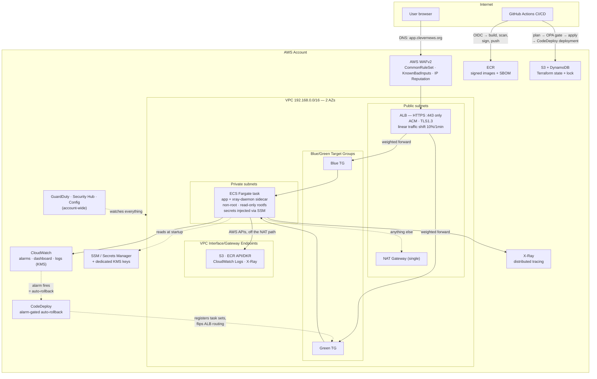

# Project Walkthrough — Secure Delivery Platform (devsecops-bootcamp)

> **Purpose of this document:** your complete interview narration for this project — from
> 60-second pitch to a 45–60 minute deep dive. Every claim here maps to real code in this
> repo (and, where noted, its CDK sibling `devsecops-bootcamp-cdk`). Practice each section
> OUT LOUD. Weekly diagrams and detail live in `weeks/*/`; the full threat model lives in
> `THREAT-MODEL.md`. This doc is the synthesis for a live conversation, not a replacement
> for either.

---

## 1. Introduction (60–90 seconds — memorize)

> "This is a production-style secure delivery platform I built on AWS — twice, actually:
> once in Terraform and once in AWS CDK, so I could compare the two approaches directly on
> the same architecture. The workload itself is deliberately simple, a Flask service,
> because the point is everything around it: network architecture, defense-in-depth
> security controls, a real CI/CD pipeline with automated rollback, account-wide threat
> detection, and a written threat model. A request hits the ALB through WAF, gets forwarded
> to ECS Fargate tasks in private subnets with no public IPs and read-only filesystems, and
> every deploy ships through CodeDeploy blue/green traffic shifting with alarm-gated
> automatic rollback — not just a rolling restart. Every image is scanned, signed, and has
> an SBOM before it ever reaches ECR. And this isn't theoretical: I've had a real production
> incident on this system, root-caused it live, fixed it, and hardened against it happening
> again — that's in here too, not hidden."

## 2. Objectives

1. **Demonstrate a secure SDLC end-to-end** — gates that block merges, not just report
   findings: SAST, SCA, container scanning, secret scanning, IaC scanning, policy-as-code,
   and DAST all run on every PR.
2. **Everything as code**, in two IaC tools — Terraform (canonical) and AWS CDK (parallel
   port) — so I can speak to the same architecture from two angles and explain real,
   structural differences between them, not just syntax differences.
3. **Defense in depth**: edge (WAF, TLS), network (private subnets, VPC endpoints, scoped
   SGs), compute (non-root, read-only rootfs), identity (least-privilege, per-purpose IAM),
   secrets (real SSM/Secrets Manager secrets, never plaintext), supply chain (SBOM + keyless
   signing), audit (flow logs, ALB logs, WAF logs, X-Ray traces — all KMS-encrypted),
   detection (GuardDuty/Security Hub/Config, account-wide).
4. **Progressive delivery that's actually progressive** — real CodeDeploy blue/green traffic
   shifting with alarm-gated automatic rollback, not a rebrand of a rolling restart.
5. **Risk-based thinking, not just tool operation** — a written STRIDE threat model with an
   honest Residual Risks section naming what's *not* covered and why that's an accepted
   trade-off at this project's scale, not an oversight.
6. **Reproducibility** — another engineer can clone, bootstrap state, and deploy from CI.

## 3. Architecture — current state

## 4. Traffic flow — "walk me through a request" (rehearse as a story)

**Step 1 — DNS.** `https://app.clevernews.org` resolves via a GoDaddy CNAME to the ALB.

**Step 2 — Edge inspection.** WAFv2 evaluates every request against three AWS managed rule
groups (Common Rule Set, Known Bad Inputs, IP Reputation) before it reaches the ALB
listener. All WAF decisions log through Kinesis Firehose to a KMS-encrypted S3 bucket.

**Step 3 — TLS termination + traffic shift.** The ALB listener accepts only :443
(`ELBSecurityPolicy-TLS13-1-2-2021-06`, ACM certificate). Its default action is a **weighted
forward across two target groups** — blue (currently live) and green (where the next
deployment lands) — not a simple single-target forward. During a normal request, that's
invisible; during a deploy, CodeDeploy is shifting the weight 10% every minute.

**Step 4 — Into the VPC, to the task.** Private-subnet ECS Fargate task, no public IP,
task security group only accepts the app port from the ALB's security group (SG-to-SG
reference, not CIDR). Read-only root filesystem; the only writable paths are ephemeral
`tmp` volume mounts gunicorn needs.

**Step 5 — Inside the container.** The app container has an **X-Ray daemon sidecar**
(`essential=false` — tracing failures never take the app down with it) and reads its
session-signing key from SSM/Secrets Manager via ECS's native `secrets` field at startup —
the value never appears in the task definition or plan output.

**Step 6 — Egress that mostly isn't NAT anymore.** ECR pulls, CloudWatch Logs writes, and
X-Ray trace uploads go through **VPC interface endpoints** — they never touch the NAT
gateway or public internet. The NAT gateway is still there as a fallback for anything not
covered by an endpoint, and I can speak to the honest cost trade-off here: at this scale,
4 interface endpoints cost about as much as the single NAT gateway they don't replace —
this is a security-posture improvement (traffic never leaves the VPC), not a cost win, and
I say that proactively rather than overselling it.

**Follow-ups I'm ready for:** why blue/green over a simple rolling deploy; why VPC
endpoints don't eliminate NAT entirely; SG reference vs CIDR; single NAT vs per-AZ (cost vs
AZ blast radius, a documented trade-off); how the X-Ray sidecar's `essential=false` choice
protects availability; why the session key lives in Secrets Manager/SSM and not an env var.

## 5. CI/CD flow — "how does code get here?"

**PR path (nothing merges without this):**
1. Feature branch → PR to protected `main`. No direct pushes; a second GitHub account
   reviews every PR.
2. **App gates:** pytest, Bandit (SAST), pip-audit (SCA), Trivy (container/filesystem
   scan), **gitleaks** (full git history, not just the diff), **ZAP baseline scan** against
   a locally-run copy of the exact image being built (passive-only — deliberately not
   scanning the live app, to avoid tripping its own CloudWatch alarms/GuardDuty on a
   routine PR check).
3. **Infra gates:** terraform fmt/validate → tfsec + Checkov → `terraform plan` → OPA/Conftest
   policy gate against the plan JSON. A failing policy is a failing, required check.
4. Human review + all green checks → merge allowed.

**Release path:** merge to `main` triggers the release workflow → `terraform apply` →
image built, **SBOM-generated (Syft, SPDX-JSON), attested, and signed keyless** (Sigstore
Fulcio + Rekor — no signing key to manage, tied to that exact CI run's GitHub identity) →
pushed to ECR with an immutable tag → **a CodeDeploy blue/green deployment is created**, not
just an ECS service update: new task set stands up on the green target group, health-checks,
then traffic shifts 10%/minute while `alb_5xx` and `app_error_rate` CloudWatch alarms watch
the shift — either firing mid-deployment triggers automatic rollback, reverting to the
last-known-good task set. Old (blue) task set terminates 5 minutes after a successful
cutover.

**State:** S3 backend with DynamoDB locking, versioning, KMS encryption, bootstrapped by a
separate `infra/bootstrap` stack applied manually and deliberately (account-level resources
shouldn't auto-deploy on every push the way the app does).

## 6. Security controls, layer by layer

| Layer | Controls in this repo |
|-------|----------------------|
| Pipeline | Bandit, pip-audit, Trivy, gitleaks, tfsec, Checkov, OPA/Conftest, ZAP baseline, branch protection, required review, approval-gated apply |
| Supply chain | SBOM (SPDX-JSON) attached as an in-toto attestation; keyless image signing (Sigstore); self-verification step fails the build if signing silently breaks; immutable ECR tags |
| Edge | WAFv2 (3 managed rule groups) + logged verdicts; TLS 1.3 ACM; no :80 listener; ZAP-verified security headers (CSP, X-Frame-Options, HSTS, the cross-origin-isolation trio) |
| Network | Private subnets for compute; SG-to-SG least privilege; VPC interface/gateway endpoints keep AWS-service traffic off the NAT/public path; VPC flow logs |
| Compute | Non-root, read-only root filesystem, ephemeral tmp volumes; X-Ray sidecar isolated from app availability (`essential=false`) |
| Delivery | CodeDeploy blue/green, linear traffic shift, alarm-gated automatic rollback — not just a failed-health-check rollback |
| Secrets | Real SSM Parameter Store (Terraform) / Secrets Manager (CDK) secret, dedicated KMS key, injected via ECS's native `secrets` field, least-privilege execution-role grant |
| Detection | GuardDuty (15-min frequency), Security Hub (FSBP standard), Config (7 rules curated to this project's actual resources) — all routed to a real, subscribed SNS topic via severity-filtered EventBridge rules |
| Governance | Everything as code (Terraform + a parallel CDK port); documented, justified exceptions everywhere a scanner finding was accepted rather than fixed — I can defend every one |

**Known gaps I name before the interviewer does** (this list is the actual Residual Risks
section of `THREAT-MODEL.md` — maturity is knowing them, not hiding them):
- No WAF rate-based rule — cost/complexity not justified at current traffic.
- Single NAT gateway — an availability trade-off, not a security one, documented since
  Week 2.
- No automated secret rotation — no AWS-provided rotation Lambda template exists for a
  generic app signing key, and ECS `secrets` are read once at startup, not live, so
  meaningful rotation would need a coordinated redeploy too.
- ZAP baseline is passive-only — no active-scan/pentest has been run.
- Signatures are verified in CI but **not enforced at deploy time** — nothing currently
  blocks an unsigned image pushed outside the normal pipeline from being deployed.
- The CDK repo currently has no live infrastructure deployed — its controls are verified
  *as designed* (synth-clean, cdk-nag clean), not *as running* the way the Terraform side's
  have been.
- The account security baseline is single-account, single-region — no Organizations-wide
  aggregation.

## 7. Observability

Structured JSON application logs, CloudWatch log metric filter driving an application
error-rate alarm, ALB 5xx / unhealthy-target / running-task-count alarms, a CloudWatch
dashboard (ECS, ALB, WAF, application metrics), SNS email alerting, VPC flow logs, ALB
access logs, WAF logs — all KMS-encrypted, and **X-Ray distributed tracing** giving a real
service map and request-level latency breakdown, not just log lines. The two alarms that
matter most (`alb_5xx`, `app_error_rate`) are wired directly into CodeDeploy's rollback
decision, not just alerting — that's the link between "observability" and "progressive
delivery" that makes both claims concrete instead of buzzwords.

## 8. Real problems I debugged (war stories — gold in interviews)

1. **A real production outage, self-inflicted, root-caused live.** Adding CodeDeploy
   blue/green, I added `lifecycle.ignore_changes` to the ECS service so Terraform would stop
   fighting CodeDeploy for control of the running task definition — but missed that the
   **ALB listener** needed the same protection. After a successful blue/green cutover left
   the listener weighted 100% toward green, the next `terraform apply` reset it back to
   Terraform's stale single-target config (100% blue — which had zero running tasks). The
   site returned real 503s. I diagnosed it live: checked target group health directly,
   found the running task registered to green while the listener sent 100% traffic to blue,
   manually repointed the listener to restore service immediately, then fixed the actual bug
   (`ignore_changes` on the listener too) and shipped a real incident writeup explaining
   root cause. **Lesson:** every AWS resource a system like CodeDeploy manages outside your
   IaC tool's own apply cycle needs the same "stop fighting for control" protection — not
   just the obvious one.
2. **The same class of bug looks completely different in CDK, for a real structural reason.**
   Porting blue/green to the CDK sibling, I expected to need an equivalent fix — but
   CloudFormation change sets diff against their own stored template record, not live AWS
   state, unlike Terraform's refresh-before-plan. CloudFormation never "sees" CodeDeploy's
   live listener change as drift in the first place, so there's nothing to protect against
   the same way. Same outcome, structurally different reason — a genuinely interesting,
   defensible thing to explain about how the two tools' change-management models differ.
3. **IAM permission gaps that only surface on the first real deploy of a new resource
   type.** Across this project's build, GuardDuty/Config, VPC endpoints, CodeDeploy, and SSM
   Parameter Store each hit a missing-permission failure on their first live merge — the
   CI role's policy had never needed that action before. Fixed each by editing the policy,
   verifying the fix actually landed (not just assuming a `create-policy-version` call
   succeeded), and re-running. By the last few features, I started checking IAM coverage
   *before* the first live deploy instead of after — a concrete example of turning a
   recurring failure mode into a checklist.
4. **Read-only root filesystem vs. gunicorn.** `readonlyRootFilesystem=true` broke the app
   — gunicorn writes worker heartbeat files to `/tmp`. Fixed with a Fargate ephemeral volume
   mounted at `/tmp`, `/var/tmp`, `/usr/tmp`, `--worker-tmp-dir`, `PYTHONPYCACHEPREFIX`.
   **Lesson:** hardening breaks assumptions; you harden, observe, and engineer around it —
   you don't turn the control off.
5. **A ZAP scan that needed two passes, not one.** The first fix round (security headers)
   left 2 new findings only visible on a re-scan: CSP directives that don't fall back to
   `default-src` per spec, and a missing `Cross-Origin-Resource-Policy` header alongside
   `Cross-Origin-Embedder-Policy`. **Lesson:** don't assume one fix pass catches everything
   a scanner will find — verify by re-running it.

## 9. Trade-offs & what I'd change for production

Single NAT gateway (cost vs. AZ resilience — documented, not accidental) · single `dev`
environment by design, not a missing staging environment — a second, genuinely-tested
environment would double AWS cost for a project with one contributor and no team to gate a
promotion step between environments · GoDaddy DNS instead of Route 53 (pre-existing domain;
would migrate for alias records + native health checks) · fixed `desired_count`, no
autoscaling policy yet — traffic at this scale doesn't justify it, but I'd add target-tracking
on CPU/request count first · no WAF rate-based rule yet · no
deploy-time signature enforcement (checked in CI, not blocked at admission) · a lightweight,
intentionally small **Jenkins pipeline** (`jenkins/Jenkinsfile.lite`) kept alongside as a
learning/comparison reference — it's illustrative, template-based, never actually run
against this project's real infrastructure, and I'm precise about that distinction rather
than implying it's a second production pipeline the way the CDK repo is a genuine parallel
implementation.

## 10. Conclusion (closing statement — memorize)

> "What this project proves isn't that I can run a Flask app — it's that I understand how
> real teams ship safely: layered security from WAF to read-only filesystems and signed
> images, infrastructure that only changes through policy-gated, approved pipelines,
> progressive delivery with automatic rollback tied to real alarms, account-wide threat
> detection, and a written threat model with an honest accounting of what's still a risk. I
> can trace any running container back to the exact signed commit that produced it, I've had
> a real incident on this system and can walk through exactly how I found and fixed it, and
> I built the same architecture twice — Terraform and CDK — so I can speak to real
> differences between infrastructure-as-code tools from experience, not just documentation."

---

### Practice drill
- 1-min pitch (§1) daily until effortless
- Full §4 traffic walk on a whiteboard/blank page from memory — twice a week
- Tell the §8.1 incident story out loud, unscripted, in under 2 minutes — this is the
  single highest-value story in this document; most candidates have never had a real one
- Have Claude play interviewer: "Grill me on my project walkthrough, one follow-up at a
  time, starting from the incident story."
