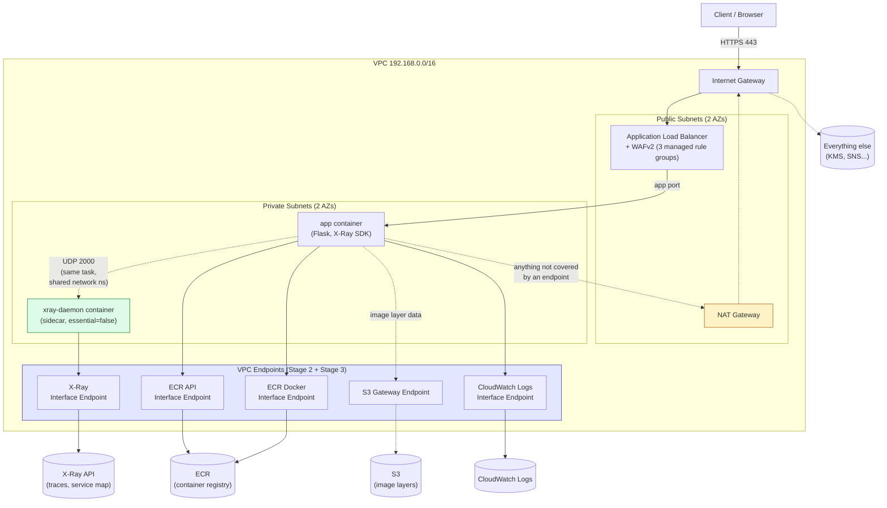

DevSecOps Project – Week 5
Progressive Delivery: Rollback, Network Isolation, Tracing, Blue/Green
Overview

Weeks 1–4 built the pipeline, the infrastructure, the policy gates, and
runtime observability. Week 5 is about what happens when a deployment goes
wrong, and how much of the network path a request travels unnecessarily.

This week lands in stages rather than all at once — each stage is its own
PR, validated independently, because each is roughly the size of a
standalone feature:

1. Rollback parity — done
2. VPC endpoints — done
3. APM / distributed tracing via X-Ray — done
4. Progressive deployment via CodeDeploy Blue/Green (next — the biggest
   piece, folds the Week 4 alarms into automatic rollback during a live
   traffic shift)

Week 5 Theme: Deploy safely, see the whole request, keep traffic off the
public path where it doesn't need to be



Stage 1 — Rollback Parity (ECS Deployment Circuit Breaker)

What changed: `aws_ecs_service.app` now has

```hcl
deployment_circuit_breaker {
  enable   = true
  rollback = true
}
```

Why this was missing here first: the CDK sibling
(`devsecops-bootcamp-cdk`) got this before the Terraform original did —
`ecs.FargateService(circuit_breaker=ecs.DeploymentCircuitBreaker(rollback=True))`
was added while porting the ECS stack, on a cdk-nag recommendation. This
closes that gap the other direction.

What it actually does: if a new task definition fails to reach a stable,
healthy state (crash loop, failing health checks, bad image, etc.), ECS
detects the failed rollout itself and automatically redeploys the previous
known-good task definition — no human, no alarm-response runbook, no
manual `terraform apply` of a revert. This is deployment-time protection:
it fires during the rollout itself, before the Week 4 alarms would even
have a chance to notice a problem in already-running traffic.

What it doesn't do (yet): this is still an all-at-once/rolling replacement
under the hood — there's no traffic shifting, no canary window, no
alarm-gated pause partway through a shift. That's Stage 4 (CodeDeploy
Blue/Green), which builds directly on top of both this and the Week 4
alarms.

Stage 2 — VPC Endpoints

What changed: `infra/modules/network/endpoints.tf` adds a Gateway endpoint
for S3 (free — ECR image layers are actually fetched from S3 under the
hood, so this covers image pulls even though it looks unrelated to ECR at
first glance) and 3 Interface endpoints (`ecr.api`, `ecr.dkr`, `logs`) in
the private subnets, behind a dedicated security group that only allows
HTTPS from inside the VPC.

Why a dedicated security group instead of reusing the ECS tasks SG: the
ECS security group lives in the `ecs` module, which itself depends on this
`network` module's subnet outputs. Scoping the endpoint SG to the ECS SG
would create a circular module dependency. Scoping to the VPC CIDR instead
still means only resources inside this VPC can reach the endpoints — not
as tight as "only the ECS tasks," but not open to anything outside the VPC
either.

**Honest cost note**: at 2 AZs and 3 interface endpoints
(~$0.01/hr × endpoint × AZ), this is roughly **$40–45/month** —
comparable to or more than the single NAT gateway it doesn't replace
(~$32–45/month, kept in place as a fallback for anything not covered by an
endpoint). This is a security-posture improvement (task traffic to
ECR/CloudWatch Logs never touches the public internet or NAT), not a cost
optimization, at this scale. A team running many services in one VPC
would see this math flip — the marginal cost per additional service using
the same shared endpoints drops to zero, while NAT data-processing charges
scale with traffic. Worth being able to explain both sides of that in an
interview rather than just claiming "cheaper."

Stage 3 — APM / Distributed Tracing via AWS X-Ray

What changed: three pieces, wired together.

1. `app/app.py` — `aws-xray-sdk` added to `requirements.txt`;
   `XRayMiddleware` wraps the Flask app, recording a segment for every
   request with `xray_recorder.configure(daemon_address=..., context_missing="LOG_ERROR")`.
   `context_missing="LOG_ERROR"` instead of the default (which raises) so a
   missing trace context — a background thread, a local run with no
   daemon — logs a warning instead of crashing a request.
2. `infra/modules/ecs/main.tf` — `aws_ecs_task_definition.app` gains a
   second container, `xray-daemon` (`public.ecr.aws/xray/aws-xray-daemon`,
   UDP 2000, `essential = false`). The app container gets `dependsOn:
   [{containerName: "xray-daemon", condition: "START"}]` so it doesn't
   start racing the daemon, and an `AWS_XRAY_DAEMON_ADDRESS=127.0.0.1:2000`
   env var — `127.0.0.1` works because `awsvpc` network mode means every
   container in the task shares one network namespace, same as `localhost`
   between processes on one host.
3. `infra/modules/iam/main.tf` — a new inline policy on `ecs_task_role`
   (previously empty) granting exactly what the daemon calls:
   `xray:PutTraceSegments`, `PutTelemetryRecords`, and the three
   `GetSampling*` reads the SDK polls for its sampling rules. All five
   require `Resource: "*"` — the X-Ray API has no resource-level ARNs to
   scope to.

Why `essential = false` on the daemon: if X-Ray's daemon crashes or can't
reach its endpoint, that should never be a reason the whole task cycles
and traffic drops. Tracing is an observability nice-to-have layered on top
of a working app, not a dependency the app's availability rides on.

VPC endpoint: `infra/modules/network/endpoints.tf`'s `interface_endpoints`
map gains a fourth entry, `xray`. Same reasoning as Stage 2 — without it,
the daemon's calls to the X-Ray API would go out via the NAT gateway, the
exact path Stage 2 exists to avoid for everything else.

What Was Achieved in Week 5 (Stages 1–3)

✔ ECS deployment circuit breaker with automatic rollback
✔ Terraform/CDK parity restored (both sides now behave the same way on a
  failed deployment)
✔ S3 gateway endpoint + 4 interface endpoints (ECR API, ECR Docker
  registry, CloudWatch Logs, X-Ray)
✔ Dedicated, VPC-scoped security group for the interface endpoints
✔ Flask app instrumented end-to-end with AWS X-Ray, daemon sidecar
  isolated from app availability via `essential = false`
✔ Least-privilege X-Ray IAM policy on the task role (5 actions, no managed
  policy)

What's Next – Week 5 Stage 4

CodeDeploy Blue/Green: a second target group, linear traffic shifting, and
the Week 4 CloudWatch alarms (`alb_5xx`, `app_error_rate`) wired as
automatic-rollback triggers *during* the shift — the point where "stronger
rollback" and "progressive deployment" become the same feature instead of
two separate ones.
