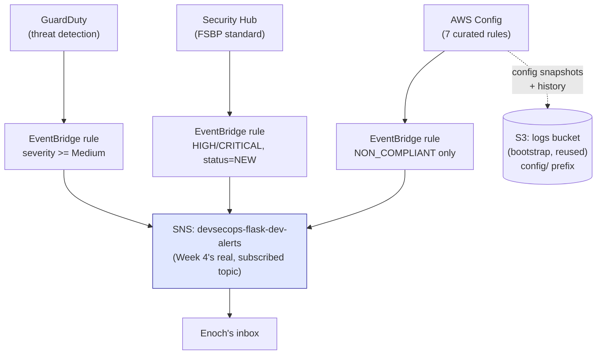

DevSecOps Project – Week 6
Account Security Baseline: GuardDuty + Security Hub + AWS Config
Overview

Weeks 1–5 built and hardened one application's delivery pipeline. Week 6
steps back to the account level: GuardDuty (threat detection), Security
Hub (compliance/posture aggregation), and AWS Config (configuration drift
and rule-based compliance) — three services that watch the whole account,
not just this one app's resources.

Where This Lives (and Why It's Different From Weeks 1–5)

`infra/bootstrap/security-baseline.tf` — not `infra/envs/dev/`. Every
Week 5 stage was infrastructure scoped to this one app's VPC/ECS service,
duplicable in the CDK sibling because each tool provisioned genuinely
separate resources. GuardDuty, Security Hub, and Config are different:
AWS allows exactly **one** GuardDuty detector, **one** Security Hub
subscription, and **one** Config recorder per account per region, full
stop. They aren't app-scoped — they're account-scoped singletons.
`infra/bootstrap/` already holds this project's other genuinely
account-wide resources (KMS keys, the Terraform state/lock backend, and a
dedicated `logs` S3 bucket tagged `Role = security-logs` — reused here as
Config's delivery channel destination rather than standing up a new
bucket).

**Not ported to `devsecops-bootcamp-cdk`.** A second
`aws_guardduty_detector` from a CDK stack wouldn't duplicate this one —
it would *conflict* with it, since only one can exist per account per
region. The honest story: this account-wide baseline, enabled once here,
already covers every resource in the account regardless of which IaC
tool deployed it, including the CDK repo's ECS service, S3 buckets, and
IAM roles.

**Applied manually, not through CI.** `infra/bootstrap` has no GitHub
Actions workflow and no remote backend — it always has been applied
directly with real local AWS credentials, the same way its original
state/KMS/logs-bucket setup was. That sidesteps the recurring "new AWS
resource type → GitHub Actions role missing IAM permission → live
pipeline failure" pattern every Week 5 stage hit at least once, since
there's no constrained CI role in the loop here at all.

Design Decisions

**GuardDuty**: one detector, `finding_publishing_frequency =
"FIFTEEN_MINUTES"` — the fastest option. Cost is driven by event volume
analyzed (CloudTrail, VPC Flow Logs, DNS logs), not publishing frequency,
so there's no cost reason to pick a slower default.

**Security Hub**: the AWS Foundational Security Best Practices (FSBP)
standard — the one AWS itself recommends as a starting baseline, and
broad enough to produce real findings against this project's actual
ECS/ALB/S3/IAM/KMS resources.

**AWS Config — curated, not exhaustive.** Enabling every available
managed rule would mostly evaluate against resource types this project
doesn't have (RDS, EC2, EBS...) — noise, not signal. Seven rules, each
checking something this project genuinely has:

| Rule | Why it's here |
|---|---|
| `S3_BUCKET_SERVER_SIDE_ENCRYPTION_ENABLED` | Every bucket in this project is KMS-encrypted |
| `S3_BUCKET_PUBLIC_READ_PROHIBITED` | Every bucket already blocks public access |
| `S3_BUCKET_PUBLIC_WRITE_PROHIBITED` | Same |
| `CLOUDTRAIL_ENABLED` | A multi-region trail already exists (pre-dates this project) |
| `VPC_FLOW_LOGS_ENABLED` | Week 1–2's network module already has these |
| `IAM_POLICY_NO_STATEMENTS_WITH_ADMIN_ACCESS` | This project has several custom IAM policies worth checking |
| `ALB_WAF_ENABLED` | Week 1–3's ALB has WAFv2 attached — a direct, concrete check |

**Alerting reuses the *real* existing SNS topic, not the unused one.**
Bootstrap already had `aws_sns_topic.ci_notifications`
(`github-actions-sns.tf`), created early in this project but never
actually subscribed to anything — nothing is listening on it. The topic
that genuinely delivers email today is `envs/dev`'s
`aws_sns_topic.alerts` (Week 4). Bootstrap has no remote-state coupling
to `envs/dev`, so it's referenced via a simple by-name data lookup
(`data "aws_sns_topic" "alerts"`) rather than a cross-state dependency,
and a new SNS topic policy statement (created from bootstrap's side —
Terraform doesn't require a resource's policy to live in the same root
as the resource) grants EventBridge permission to publish to it.

**EventBridge filtering, to keep the inbox useful**: GuardDuty routes at
severity ≥ Medium (skip Low/informational), Security Hub routes at
HIGH/CRITICAL with workflow status NEW (the FSBP standard alone produces
dozens of checks — most Low/Medium findings aren't worth an email),
Config routes only NON_COMPLIANT changes (a compliant evaluation isn't
an actionable alert).

**Honest cost note** (same spirit as Week 5 Stage 2's VPC endpoints
note): none of these three services are free. Rough scale for an account
this small — GuardDuty: typically low single-digit $/month at this event
volume. Security Hub: ~$0.0010 per security check per region; the FSBP
standard runs dozens of checks, typically low single-digit $/month for
this resource count. Config: ~$0.003 per recorded configuration item +
~$0.001 per rule evaluation. Combined, realistically a handful of dollars
a month — not zero, worth knowing rather than being surprised by the
bill.

What Was Achieved in Week 6

✔ GuardDuty enabled account-wide, 15-minute finding frequency
✔ Security Hub enabled with the AWS Foundational Security Best Practices
  standard
✔ AWS Config recording, with 7 rules curated to this project's actual
  resource types, delivering to the existing hardened `logs` S3 bucket
✔ All three wired to Week 4's real, already-subscribed SNS topic via
  severity/compliance-filtered EventBridge rules — no new inbox to check
✔ Zero duplication in the CDK sibling, by design — this baseline already
  covers its resources too
